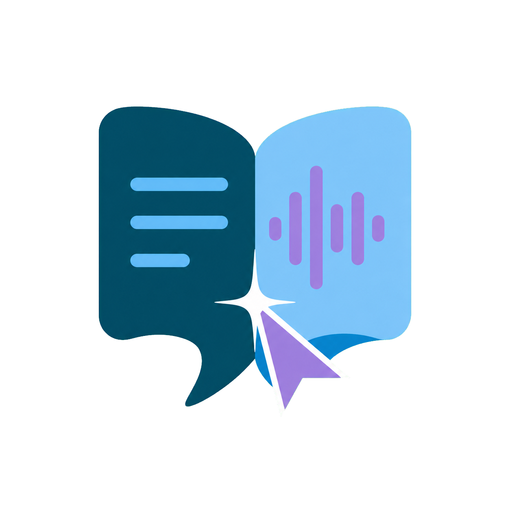

<div align="center">



# Luma Translate

**右键双击，即刻看懂屏幕上的英文。**

离线词典点译 · 本地 OCR · 可选 AI 长句翻译 · 截图永不出本机

[](#系统要求)
[](#从源码构建)
[](LICENSE)
[](../../releases/latest)
[](../../releases)

[下载使用](#下载使用) · [功能演示](#功能演示) · [隐私边界](#隐私边界) · [使用手册](docs/使用手册.md)

</div>

---

<!-- ────────────────────────────────────────────────────────────
     海报位：把你做好的海报图片拖进来
     网页编辑 README 时直接把图片拖进编辑框，GitHub 会自动上传并
     生成一行  代码，
     把下面这行替换掉即可。图片上限 10 MB。
     ──────────────────────────────────────────────────────────── -->


## 这是什么

Luma Translate 是一款给**中文母语者**用的 Windows 屏幕阅读辅助工具，专门解决一个场景：你在读英文网页、PDF、软件界面或图片，遇到不认识的词，不想复制粘贴、不想切换窗口、不想打断阅读。

把鼠标移过去，**快速按两下右键**，释义就浮出来了。

它和常见翻译工具的区别在于三点：

- **不要求文字能选中。** 用的是 Windows 本地 OCR，图片里的字、PDF 扫描件、游戏界面、加了防复制的网页，一样能认。
- **默认完全离线。** 内置 47,149 条 ECDICT 核心词条，点译不联网、不上传、不留痕。
- **不占用键盘快捷键。** 只用鼠标手势，单击右键仍然正常弹出原来的右键菜单。

## 功能演示

<!-- ────────────────────────────────────────────────────────────
     宣传片位：GitHub 支持在 README 里直接播放视频
     在网页上编辑 README 时，把 .mp4 / .mov / .webm 拖进编辑框，
     GitHub 会上传并生成一段可播放的链接，粘在下面这行位置。
     免费账号单个视频上限 10 MB；超了就压一下，或者改放 GIF，
     或者贴 B 站 / YouTube 封面图 + 链接。
     ──────────────────────────────────────────────────────────── -->

> 把宣传片拖到这里

| 手势 | 效果 |
| :--- | :--- |
| **右键双击** | 离线点译：音标、词性、中文释义、英文简明解释、例句、本地朗读 |
| **右键长按 ~420 ms 后拖拽** | AI 长句翻译：整句中文翻译、英文解释、句子结构、生活用法（需自备 API Key） |
| **单击右键** | 不触发任何翻译，照常弹出软件原本的右键菜单 |

### 离线点译

在英文上快速按两次右键，程序截取鼠标附近的一小块画面，在内存里做 OCR，然后查本地词典，弹出紧凑的渐变气泡。全程不联网。

气泡里可以直接朗读英文原文和英文解释，用的是 Windows 本机语音，不走云端。

### AI 长句翻译（可选）

整句话涉及语法、指代和上下文，逐词拼接必然不自然。所以长句走 AI：按住右键约 420 毫秒，拖过要翻译的句子，松手后程序**先在本地 OCR**，只把识别出来的**英文文本**发给你选定的 AI。

支持 DeepSeek 和 Google Gemini，**密钥由你自己提供**，程序不内置、不代理、不转发。没配置密钥时，长按拖拽不会触发任何联网行为。

### 新加坡本地化

离线词库里额外维护了一层本地表达：`MRT`、`HDB`、`CPF`、`hawker centre`、`kopitiam`、`void deck`、`lah`、`lor`、`shiok`、`chope` 等。

## 下载使用

到 **[Releases](../../releases/latest)** 下载最新版压缩包，解压后打开 `source` 文件夹，双击 `build.cmd`，等 10–30 秒自动编译并启动。

> **为什么要自己编译一下？**
> 因为这个程序用的是 Windows 系统自带的 .NET 编译器和 OCR 组件，编译出来的 exe 依赖具体机器上的组件版本。本地编译一次，反而比下载别人打包的 exe 更稳、也更安全——你能看到编译进去的每一行代码。全程不需要安装任何开发工具。

程序启动后会缩到系统托盘。单击托盘图标打开控制中心，可以切换模式、手动输入英文、配置 AI。

### 首次使用检查

- Windows 需要装了**英语 OCR 语言包**（设置 → 时间和语言 → 语言，给 English 添加"可选功能 → 光学字符识别"）
- 想要更自然的朗读，可在 Windows 语音设置里装 Natural / Neural 系列英语语音

## 隐私边界

这部分是这个项目最在意的地方，所以说得具体一点：

| 数据 | 去向 |
| :--- | :--- |
| 屏幕截图 | **永远不离开本机。** 只存在于内存，OCR 完成即释放，不写磁盘、不进剪贴板、不存历史 |
| 离线点译内容 | **不联网。** 本地词库没查到也不会偷偷调 AI |
| AI 长句的英文文本 | 仅在你**选定服务 + 填了密钥 + 明确同意**三个条件都满足后，发送给该服务的固定主机 |
| API Key | 存在本机，可选用 Windows DPAPI 加密；程序不记录、不显示完整 Key |
| 朗读 | Windows 本机语音合成，不上传文字 |
| 遥测 / 安装标识 | **没有** |

即便如此，仍建议：不要在密码、密钥、身份证件、医疗或财务信息附近使用 AI 长句选区。内容敏感时从托盘暂停 AI 手势，只用离线点译。

## 系统要求

- Windows 10 / 11 **x64**
- .NET Framework 4.x（Windows 自带）
- 至少一个**英语 OCR 语言包**

已知限制：极小字号、模糊、低对比或严重遮挡的文字会降低 OCR 准确率；UAC 安全桌面、锁屏界面、DRM 保护的视频、部分独占全屏游戏和远程桌面无法截图；个别高权限程序或反作弊系统可能拦截全局鼠标监听。

完整的限制清单见[使用手册](docs/使用手册.md#系统要求与限制)。

## 从源码构建

```bat
source\build.cmd
SGFloatingTranslator.Tests.exe
```

`build.cmd` 调用 Windows 自带的 64 位 .NET Framework 编译器（`C:\Windows\Microsoft.NET\Framework64\v4.0.30319\csc.exe`），把词库作为嵌入资源打进 exe，同时生成主程序和自检程序。自检通过会显示 `ALL TESTS PASSED`。

不需要 Visual Studio，不需要 NuGet，不需要联网。

## 关于安全软件报警

这个程序会做两件敏感的事：**全局监听鼠标**和**截取屏幕**——这是它工作的前提。加上目前的 exe 没有代码签名证书，所以 Windows SmartScreen 和部分杀毒软件可能会报警。

这也正是本项目**开放全部源码、并让你在自己机器上编译**的原因：所有网络请求的目标主机都写死在代码里（`api.deepseek.com` 和 `generativelanguage.googleapis.com`），你可以自己核对。

## 项目结构

```
source/            全部 C# 源码
  Program.cs         主程序、词典引擎、控制中心
  MouseOcr.cs        鼠标手势与屏幕 OCR
  ModernUi.cs        界面绘制
  DeepSeek.cs        AI 客户端（DeepSeek / Gemini）
  AiSettingsDialog.cs AI 设置窗口
  LocalSpeech.cs     本地语音合成
  SelfTest.cs        自检
  build.cmd          一键编译
  data/              离线词库（gzip）+ 校验清单
assets/            图标与图片
docs/              完整使用手册
licenses/          第三方许可证
```

## 词库来源

离线词库由 [ECDICT](https://github.com/skywind3000/ECDICT)（MIT）于 2026-07-22 下载并筛选生成，保留 47,149 条核心词条。筛选规则、记录数和 SHA-256 校验值见 [`source/data/manifest.json`](source/data/manifest.json)，生成脚本见 `source/BuildOfflineDictionary.cs`。

第三方说明见 [THIRD_PARTY_NOTICES.md](THIRD_PARTY_NOTICES.md)。

## 许可证

本项目源码采用 [MIT License](LICENSE)。

内嵌词库源自 ECDICT（MIT），Windows OCR 与语音组件不随本项目分发，DeepSeek / Gemini 的使用受各自服务条款约束。用于大规模商业分发前，请自行核查词库数据来源与目标地区的合规要求。

---

<div align="center">

如果这个工具帮到了你，点个 ⭐ Star 是最好的鼓励。

遇到问题欢迎提 [Issue](../../issues)。

</div>
