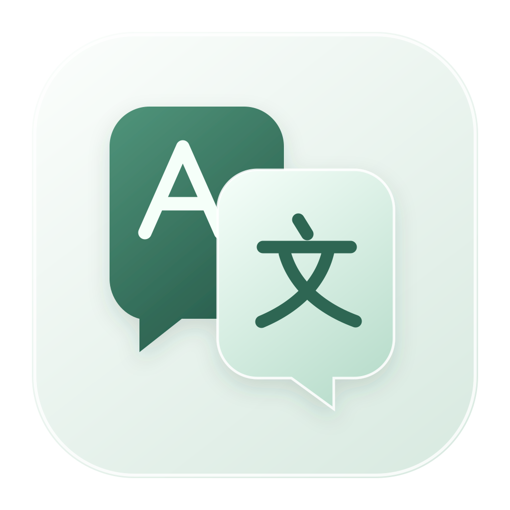

<div align="center">



# Luma Translate for macOS

**右键双击，即刻看懂屏幕上的英文。**

原生 macOS · Apple Silicon + Intel 通用 · Vision 本地 OCR · 767,778 条离线词典

</div>

## 这是真正的 macOS 移植

本项目已把原 Windows x64 / WinForms 程序改写为原生 SwiftUI + AppKit 应用。它不是 Wine、虚拟机或 exe 包装器。发布脚本会生成同时包含 `arm64` 与 `x86_64` 两个切片的 Universal 2 `.app`、`.zip` 和 `.dmg`。

保留的主要能力：

- **右键双击**：截取鼠标附近的小区域，以 Apple Vision 在本机 OCR，再查本地 ECDICT 词典。
- **右键长按约 420 ms 后拖拽**：框选英文句子，在本机 OCR 后交给用户选择的 DeepSeek 或 Gemini；未配置 Key 时不联网。
- **普通右键单击**：等待系统双击间隔后原样回放，仍会打开原应用的上下文菜单。
- **本地朗读**：使用 macOS 内置英语声音，不上传文字。
- **安全存储**：API Key 存在 macOS 钥匙串；请求只允许固定 HTTPS 主机，拒绝 HTTP 重定向。

## 系统要求

- macOS 13 Ventura 或更新版本
- Apple Silicon（M 系列）或 64 位 Intel Mac
- 全局手势需要用户授予“辅助功能”和“屏幕录制”权限
- 从源码构建需要 Xcode 15 或更新版本（命令行工具也要安装）

## 安装包与 GitHub Actions

本次交付提供 `Luma-Translate-macOS-Universal-1.1.0.dmg`，打开后拖入 Applications 即可安装，M1 无需 Rosetta。

在仓库根目录执行 `.github/workflows/verify-mist-ui.yml`（Actions 中名称为 **Build and verify Luma desktop installers**）。`Luma-macOS-Universal` artifact 包含 DMG、应用 ZIP 和 Apple Silicon 验证记录；`Luma-macOS-Intel-verification` 包含同一安装包的 Intel 运行结果。这个验证工作流不会自动发布 Release。

## 在 Mac 本机构建

```bash
swift test
chmod +x scripts/build-universal.sh
LUMA_VERSION=1.1.0 scripts/build-universal.sh
lipo -archs ".build/luma-universal/Luma Translate.app/Contents/MacOS/LumaTranslate"
```

最后一条命令必须显示：

```text
x86_64 arm64
```

产物位于 `.build/dist/`。

## 首次启动

1. 打开应用，点击左侧“开启全局手势”。
2. 按提示到“系统设置 → 隐私与安全性”允许 **辅助功能** 与 **屏幕录制**。
3. 若屏幕录制刚授权后仍显示不可用，完全退出应用再打开一次。
4. 将鼠标放在任意应用中的英文单词上，快速按两次右键。

没有 Apple Developer ID 签名的自构建版本采用 ad-hoc 签名。本次包尚未经过 Apple 公证；若首次打开被系统阻止，核实来源后可在“系统设置 → 隐私与安全性”对本应用选择“仍要打开”。

## 签名与公证

构建脚本在存在 `CODE_SIGN_IDENTITY` 时会启用 hardened runtime 并使用该 Developer ID 签名；否则使用 ad-hoc 签名：

```bash
CODE_SIGN_IDENTITY="Developer ID Application: Your Company (TEAMID)" \
  LUMA_VERSION=1.1.0 scripts/build-universal.sh

APPLE_ID="name@example.com" \
APPLE_TEAM_ID="TEAMID" \
APPLE_APP_PASSWORD="xxxx-xxxx-xxxx-xxxx" \
  scripts/notarize.sh ".build/dist/Luma-Translate-macOS-Universal-1.1.0.dmg"
```

不要把证书、密码或 API Key 提交到仓库。

## 隐私边界

| 数据 | 去向 |
| --- | --- |
| 屏幕截图 | 只在内存中交给 Apple Vision；不写磁盘、不上传 |
| 离线点译文字 | 只查随应用分发的本地词典 |
| AI 框选英文 | 仅在配置 Key、选择服务并首次确认目标主机后发送 |
| API Key | macOS 钥匙串，或仅保留在当前进程内存 |
| 朗读文字 | macOS 本机 `AVSpeechSynthesizer` |
| 遥测 | 没有 |

完整平台替换说明见 [`docs/WINDOWS_TO_MACOS_PORT.md`](docs/WINDOWS_TO_MACOS_PORT.md)。

## 许可证

应用源码采用 MIT License。离线词典源自 ECDICT（MIT）；详见 `THIRD_PARTY_NOTICES.md` 和应用资源中的 `ECDICT_LICENSE.txt`。